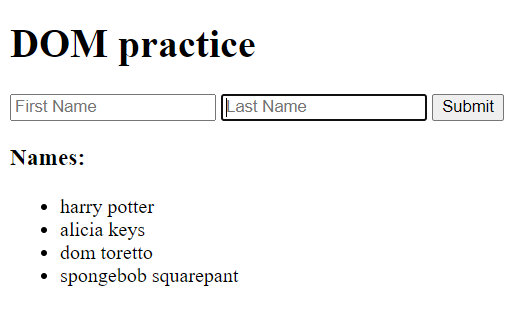
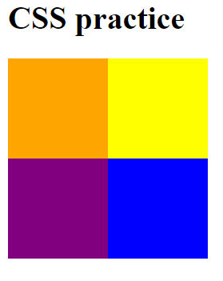
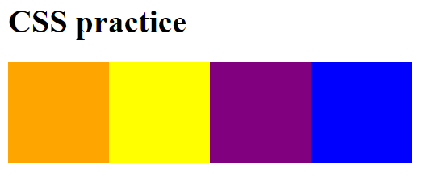
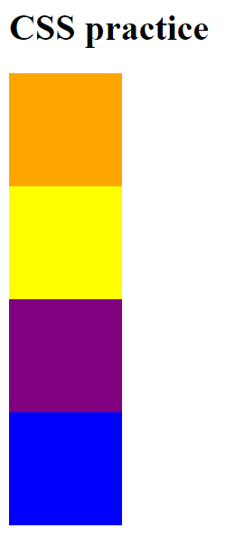

# Mid-level assessment for V School level 1

Hello! Congratulations on reaching the mid-level assessment for level 1! This is meant to be an opportunity to practice a few of the concepts you've already learned before this. 

Please don't stress. If you're struggling with something in this assessment, we can work through it.

Below are some screenshots of what the page in the browser should look like when you complete each portion.

## Append list items to the DOM:

## Set up squares into a 2x2 grid:

## Set up squares into a row using flexbox:

## Set up squares into a column using flexbox:
